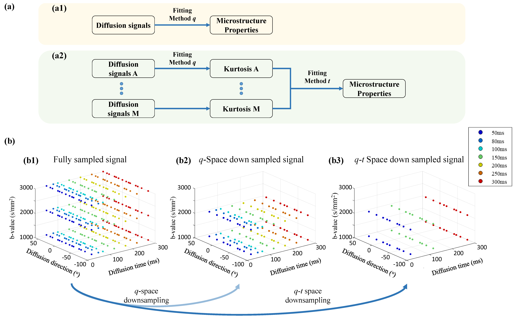
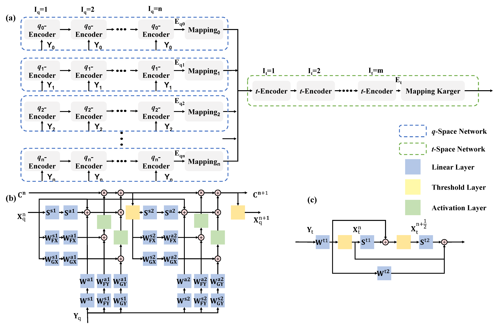

# *t*DKI-Net: a joint *q-t* space learning network for diffusion-time-dependent kurtosis imaging

## Milestone
- **[02/2025]** The figures in the paper have been released.
- **[12/2024]** The paper of *t*DKI-Net has been published online [[J-BHI](https://ieeexplore.ieee.org/abstract/document/10568339)].
- **[04/2024]** The demo of *t*DKI-Net has been released.


## Introduction

Regular non-learning based fitting of tDKI, such as linear least square fitting, requires densely sampled q-t space (Fig. 1(b1)). Previous learning-based methods primarily focused on investigating the sparsity of the q-space (Fig. 1(b2)), while the tDKI model also has sparsity in t-space and the joint q-t space. In this work, we proposed a joint q-t space downsampling strategy to accelerate tDKI acquisition (Fig. 1(b3)).

<p align="center">
   
</p>
<p align="center"> Fig.1 The overall structure of two fitting methods. <p align="center">

This repository provides a simplified demonstration of a q-t space acceleration network for tDKI model, tDKI-Net. In this repository we offer an inference framework on three kinds of downsampling mode namely q-1, t-1, and q-t-1 corresponding to our manuscript. The project was originally developed for our work on t-DKI Net and can be used directly or fine-tuned with your dataset. 

<p align="center">
   
</p>
<p align="center"> Fig.2 The overall network structure. <p align="center">


## Requirements

Before you can use this package for image segmentation. You should install the follwing libary at least:
- PyTorch version >=1.8
- Some common python packages such as Numpy, H5py, NiBabel ...

## How to use

1. Compile the requirement library.

2. Download our pretrained models and data from the link: <https://drive.google.com/drive/folders/1Uezgc3m4_CzZUuXN0vmZ5VtA27izV1KS?usp=drive_link>

3. Run our demo, using q-t-1 as an example
    ```   
    python test.py
    ```
4. If you want to try q0, just specify input_nc as 210 and output_nc as 9, while for td0, input_nc is 450 and output_nc is 7. 

## Citation

If you find it useful for your research, please consider citing the following sources:


Simplified J-BHI version for tDKI-Net, first attempt at q-t space downsampling

```
@ARTICLE{10568339,
   author={Zheng, Tianshu and Ba, Ruicheng and Huang, Yongquan and Wu, Dan},
   journal={IEEE Journal of Biomedical and Health Informatics}, 
   title={tDKI-Net: A Joint q-T Space Learning Network for Diffusion-Time-Dependent Kurtosis Imaging}, 
   year={2024},
   pages={1-11},
   doi={10.1109/JBHI.2024.3417259}}
```

Original MICCAI version, first adopted the extragradient method in the qMRI / microstructure estimation area

```
@inproceedings{zheng2022adaptive,
  title={An adaptive network with extragradient for diffusion MRI-based microstructure estimation},
  author={Zheng, Tianshu and Zheng, Weihao and Sun, Yi and Zhang, Yi and Ye, Chuyang and Wu, Dan},
  booktitle={International Conference on Medical Image Computing and Computer-Assisted Intervention},
  pages={153--162},
  year={2022},
  organization={Springer}
}
```


## Acknowledge and Statement

- This project was designed for academic research, not for clinical or commercial use, as it's a protected patent.
  
- If you have any questions, please feel free to contact [me](mailto:zhengtianshu996@gamil.com).


